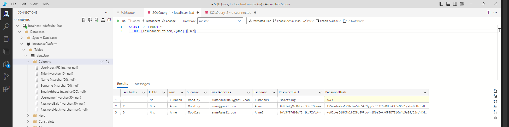

# InsurancePlatform
The overall design for this system would be to seperate out the different concerns. The Database could be abstracted away by using an Open API Service with seperate API and Datamodels. This API can be used by frontends as well as other services if required. 

## Insurance Users
The Insurance Users Solution was targeted as the API to interact with User registration, retrieval and management. Using OpenAPI specification 3.0 allowed for the API designed to be standardised, and selfdocumenting. In its implementation there were seperation of Database models from API models as these are two different concepts. 

The `/api/User`,  `/find`, `/api/User/Register` and `/api/User/Login` endpoints are functional however time was spent on Authorisation and Authentication which would have required significant more time to develop base on use case. Hence you will see unused code around Authorisation

### ASP.Net Core
Using an API first design approach, the restful APIs were designed an implemented. Then the backend implementation was done. 

### Micro ORM
Dapper was chosen as the Micro ORM for our Insurance Application. It has all the features and support required to back an Enterprise application. 

### Microsoft SQL Server Setup
MSQL can now be run on ubuntu machines, so this unlocks hosting on various cloud platforms (AWS, Google Cloud, Azure)
Image was obtained from docker hub using the below command:

`docker pull mcr.microsoft.com/mssql/server`

To run the image use the below command:

`docker run -e "ACCEPT_EULA=Y" -e "MSSQL_SA_PASSWORD=yourStrong(!)Password"  -p 1433:1433 -d mcr.microsoft.com/mssql/server:2022-latest`

Once executing via linux or WSL on windows, you will be able to login to the server using SQL Server Management Studio or Azure Data Studio. 

Ensure that the same container is started again for the application to retain, tables and data from previous runtimes. 

#### SQL Scripts
Setup of the Databases can be done via the SSMS/AzureDataStudio Application via Frontend or script.

Where scripts were used they are stored in the `InsurancePlatform\InsuranceUsers\Scripts` folder. 

## Insurance Quote

### ASP.Net Core Razer
The Insurance Quoting frontend would have been developed using Razer and if time permitted integration of Next.js could have been done. This frontend would have communicated via REST to the InsuranceUser service as well as other services if required. 

## Proposed Design

Based on the problem statement, various tables could have been created based on Manufacturer, Model and Risk. I would have used foreign key constraints on Quote table that linked to these other tables using basic relational database strategy.  
